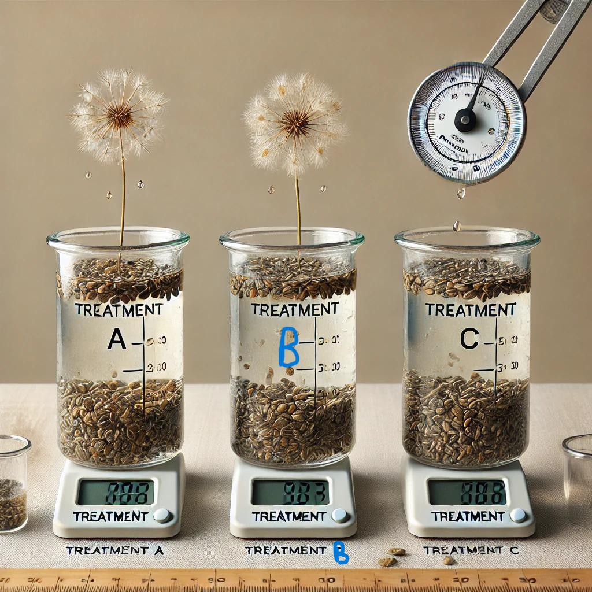
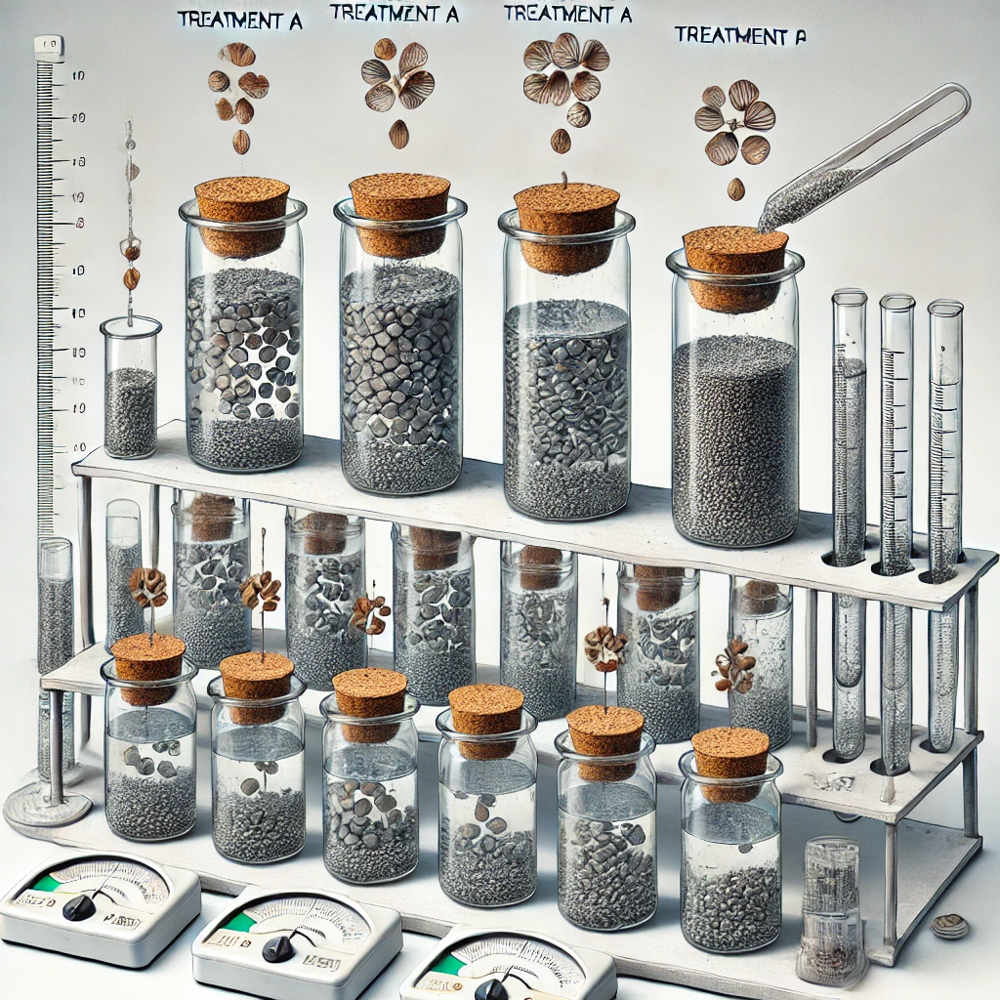
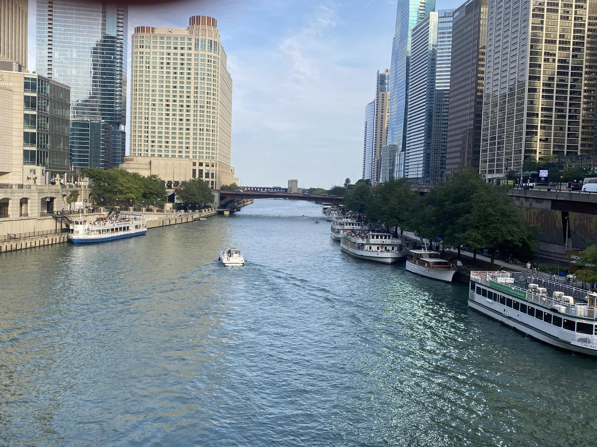
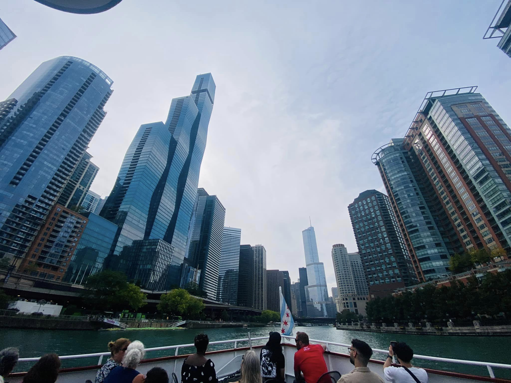
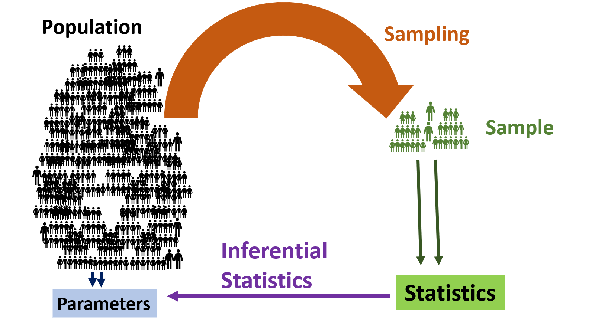

```{r xaringan-themer, include=FALSE, warning=FALSE}
library(xaringanthemer)
style_mono_accent(
  base_color = "#081d58",
  text_bold_color = "#ce1256",
  title_slide_text_color = "#edf8b1",
  header_font_google = google_font("Josefin Sans"),
  base_font_size = "20px",
  text_font_size = "1.5rem",
  code_font_size = "1rem"
 #text_font_google   = google_font("Montserrat", "300", "300i")
 # code_font_google   = google_font("Fira Mono")
)
```

## Essential Statistical Skills

1. Statistical software and programming skills

2. Data wrangling skills

3. Data visualization skills

4. Design and analysis of experiments

4. Statistical modelling skills

5. Machine learning skills

6. Communication skills

---
class: titled, middle

## We have AI and ChatGPT.

## We don't need these skills anymore.

---
class: titled, middle

## ~~We have AI and ChatGPT~~.

## ~~We don't need these skills anymore~~.

# AI-based tools are powerful, but it is most effective **when used in combination with human expertise.**

---
class: titled, middle

## ~~We have AI and ChatGPT~~.

## ~~We don't need these skills anymore~~.

##  AI-based tools are powerful, but it is most effective **when used in combination with human expertise.**

- **Improve prompt engineering:** Knowing the underlying concepts helps in framing better questions and guiding AI to give accurate and relevant outputs

- **Evaluate AI-generated outputs:**  To critically assess whether AI-generated results are valid and make sense for your problem

---
class: inverse, center, middle

# Example 1

---
.pull-left[
Determine **which natural seed (Species A, B, or C) is most effective in reducing turbidity** in water samples.

- The tests were carried out, using artificial turbid
water with conventional jar test apparatus.

> Response variable = Turbidity Reduction Efficiency (TRE %)

]

.pull-right[


]


---

.pull-left[

## Data

```{r, echo=FALSE}
Treatment <- c("A", "B", "C")
TRE <- c(10, 55, 80)
df <- data.frame(Tratment=Treatment,
                 TRE = TRE)
df |> knitr::kable()
```

- Statistical conclusions cannot be drawn based on one replicate.

]

.pull-right[


]


---

.pull-left[

- Independent Variable (Treatment): Type of natural seed added to the water.

    - Treatment A: Seed A
    - Treatment B: Seed B
    - Treatment C: Seed C

- Dependent Variable: Turbidity Reduction Efficiency

- Randomization

- Replication


]


.pull-right[



]

---

## Completely Randomized Design (CRD)

.pull-left[


]

---

##  Common Experimental Designs

.pull-left[

- Completely Randomized Design (CRD)

- Randomized Complete Block Design (RCBD)

- Latin Square Design

- Factorial Design

- Split-Plot Design

- Nested Design

]

---

class: inverse, center, middle

# Example 2

---

## Chicago River: Water Quality Monitoring

.pull-left[



]

.pull-right[


]

- Measure the pH level of water at a specific location daily at 10 PM over a two-year period.

---
.pull-left[
```{r, echo=FALSE, message=FALSE, warning=FALSE}
# Load necessary libraries
library(dplyr)
library(kableExtra)

# Set the start and end dates
start_date <- as.Date("2022-01-01")
end_date <- as.Date("2023-12-31")

# Generate a sequence of dates for two years
date_column <- seq.Date(from = start_date, to = end_date, by = "day")

# Generate random pH values between 6.5 and 8.5 (common range for natural water)
set.seed(123) # For reproducibility
pH_values <- round(runif(length(date_column), min = 6.5, max = 8.5), 2)

# Create the dataset
data <- data.frame(
  Date = date_column,
  pH = pH_values
)
kable(data, caption = "pH Data ", align = "c") |>
  kable_styling(bootstrap_options = "striped", full_width = FALSE, font_size = 14) |>
  column_spec(1, width = "4cm") |>
  column_spec(2, width = "3cm")
```
]

.pull-right[

## Time series data

- Sequence of data points recorded at regular time intervals. 

- Temporal dependency: Data points are dependent on time
]


---
class: inverse, center, middle

# Example 3

---

## Spatial data

.pull-left[


]


.pull-right[


]

- Measure the pH level of water at multiple locations on a given day.


--- 
class: inverse, center, middle

# Example 4

---

## Spatio-temporal data

.pull-left[


]


.pull-right[


]

- Measure the pH level of water at multiple locations daily at 10 PM over a two-year period.

---




---
class: inverse, middle, center

## Nature of your research problem


---

## Statistical Inference: (Point and Interval Estimates)

Suppose you collect daily pH measurements from the Chicago River over a year. You want to **estimate** the average pH level of the river for the year.

> Point Estimate

> Interval Estimate (Confidence Interval)

Eg:  A 95% confidence interval for the mean pH might be (7.0, 7.4). 

---

## Statistical Inference:  Hypothesis Testing

Suppose you are analyzing water quality data from the Chicago River and want to determine whether there is a significant difference in the average pH levels during the winter and summer months.

$$H_0: \mu_{winter} = \mu_{summer}$$

$$H_1: \mu_{winter} \neq \mu_{summer}$$

---

## Forecasting

Measure the pH level of water at a specific location daily at 10 PM over a two-year period. You are interested in forecasting the  pH level in the upcoming months based on historical data.

---

## Spatial Interpolation

Suppose you have pH level measurements from various monitoring stations along the Chicago River, and you want to estimate the pH levels at unobserved locations between these stations.

---

## Cluster Analysis Problem

- You have collected water quality data from various locations along the Chicago River, including multiple parameters such as pH, dissolved oxygen (DO), turbidity, temperature, and nitrate concentration. 

- The goal is to identify clusters of locations with similar water quality profiles, which could help in identifying areas with potential pollution sources or regions requiring special attention for water management.

---

## Making Predictions

Predict the pH level of a river location based on various environmental and infrastructural features.


---

.pull-left[

### Supervised Learning

**Dependent Variable:** pH level

**Independent variables:**

-  The count of industrial establishments near the location

- Average rainfall

- Average temperature

- Land use

- Soil type ( (e.g., agriculture, urban, forest))

]


.pull-right[

### Unsupervised Learning


**Independent variables:**

- pH level

-  The count of industrial establishments near the location

- Average rainfall

- Average temperature

- Land use

- Soil type ( (e.g., agriculture, urban, forest))


]